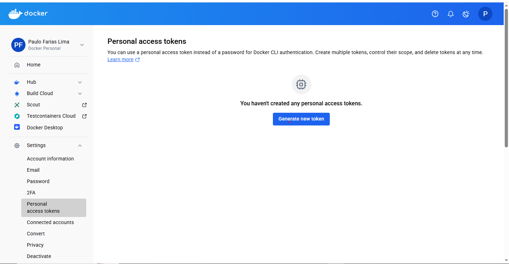
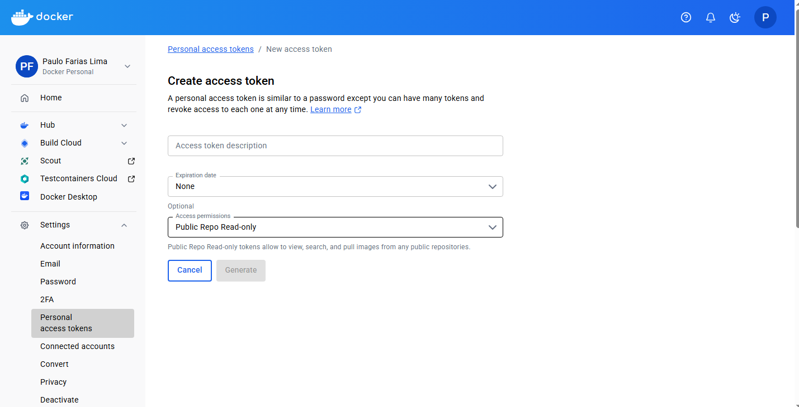
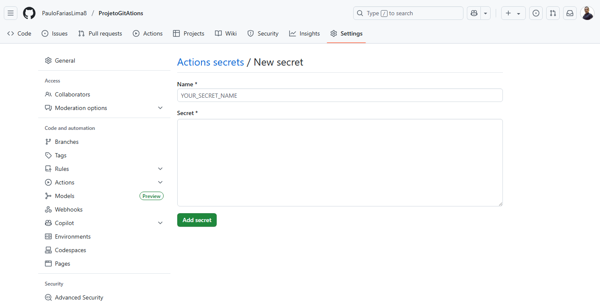
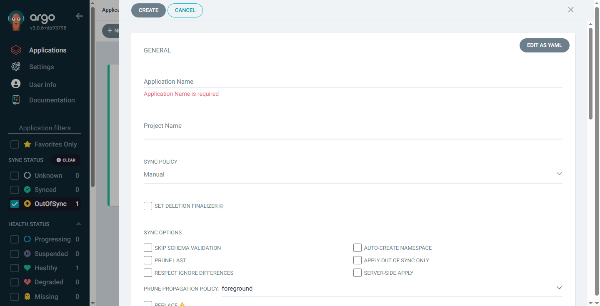
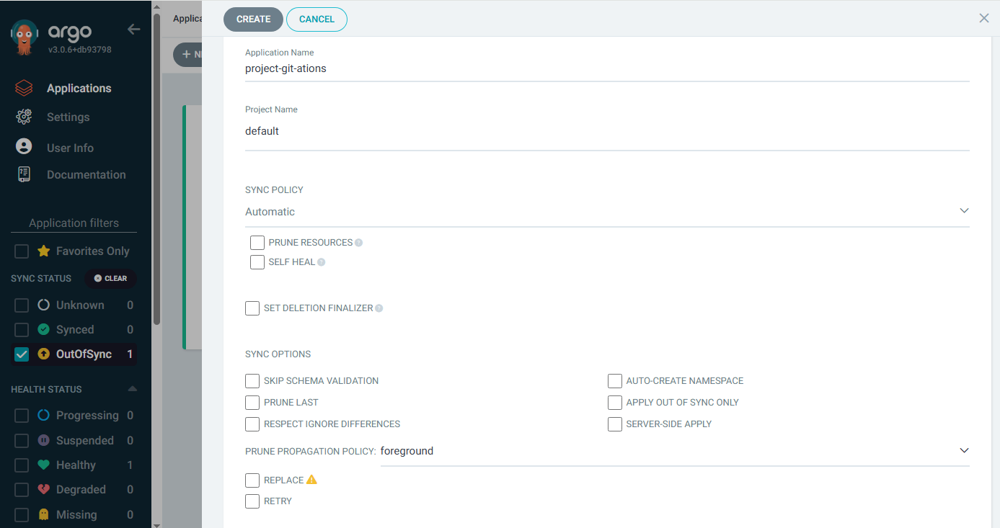
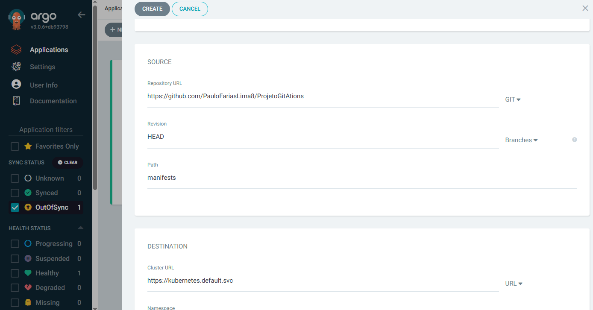
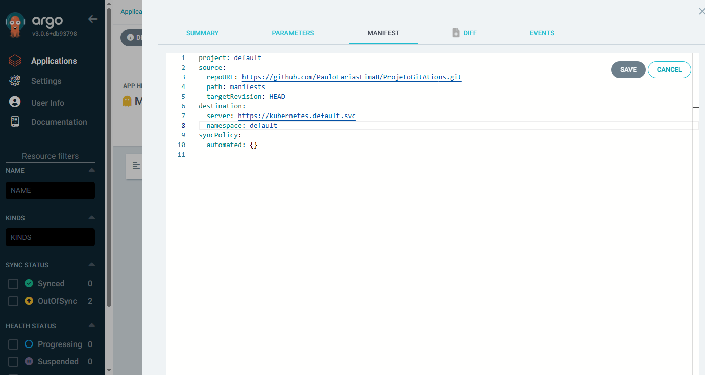

# ProjetoGitAtions

## Objetivo

Automatizar o ciclo completo de desenvolvimento, build, deploy e
execução de uma aplicação FastAPI simples, usando GitHub Actions para
CI/CD, Docker Hub como registry, e ArgoCD para entrega contínua em
Kubernetes local com Rancher Desktop.


## Índice
1. [Pré-requisitos](#-pré-requisitos)
2. [Etapa 1: Conta Github e Aplicação FastAPI](#-etapa-1-aplicação-fastapi)
3. [Etapa 2: GitHub Actions](#-etapa-2-github-actions)
4. [Etapa 3: Manifestos Kubernetes](#-etapa-3-manifestos-kubernetes)
5. [Etapa 4: Configuração do ArgoCD](#-etapa-4-configuração-do-argocd)
6. [Etapa 5: Teste do Pipeline](#-etapa-5-teste-do-pipeline)
7. [Entregas Esperadas](#-entregas-esperadas)

---

## Pré-requisitos

### Ferramentas Necessárias
| Ferramenta | Descrição | Como Verificar |
|------------|----------|----------------|
| GitHub Account | Conta para hospedar repositórios | Acessar [github.com](https://github.com) |
| Docker Hub | Registry para imagens Docker | Criar em [hub.docker.com](https://hub.docker.com) |
| Rancher Desktop | Kubernetes local | `kubectl get nodes` deve funcionar |
| kubectl | CLI para Kubernetes | `kubectl version --client` |
| ArgoCD | Ferramenta GitOps | `kubectl get pods -n argocd` |

### Etapa 1. Conta Github e Aplicação FastAPI

1. Passo: 
Criar o repositório ProjetoGitAtion no Github.
2. Passo: 
Criar uma pasta AppHello para colocar o FastAPI.
Script em Python do FastAPI

```Bash
from fastapi import FastAPI

app = FastAPI()

@app.get("/")
async def root():
    return {"message": "Hello World"}
```
3. Passo: 
Criar o Dockerfile.

```Bash
FROM python:3.9
WORKDIR /app
COPY requirements.txt .
RUN pip install --no-cache-dir -r requirements.txt
COPY . .
CMD ["uvicorn", "main:app", "--host", "0.0.0.0", "--port", "8000"]
```

4. Passo: 
Criar o Requeriments.txt

```Bash
fastapi==0.68.0
uvicorn==0.15.0
```

5. Passo: 
Criar diretório Workflows. 
Dentro do diretorio criar o arquivo: 

``` bash
name: CI/CD Pipeline
on: [push]
jobs:
  build-and-deploy:
    runs-on: ubuntu-latest
    steps:
      - uses: actions/checkout@v3
      
      - name: Login to Docker Hub
        uses: docker/login-action@v2
        with:
          username: ${{ secrets.DOCKER_USERNAME }}
          password: ${{ secrets.DOCKER_PASSWORD }}
          
      - name: Build and push
        uses: docker/build-push-action@v4
        with:
          context: .
          push: true
          tags: ${{ secrets.DOCKER_USERNAME }}/hello-app:latest
```
6. Passo: 
Criação dos Manifestos kubernetes.
Crie uma pasta manifests. Dentro da pasta crie o arquivo deployment.yaml. 
````bash
apiVersion: apps/v1
kind: Deployment
metadata:
  name: hello-app
spec:
  replicas: 1
  selector:
    matchLabels:
      app: hello-app
  template:
    metadata:
      labels:
        app: hello-app
    spec:
      containers:
      - name: hello-app
        image: <SEU-USER>/hello-app:latest
        ports:
        - containerPort: 8000
````
Despois crie o arquivo service.yaml.

````Bash
apiVersion: v1
kind: Service
metadata:
  name: hello-app
spec:
  selector:
    app: hello-app
  ports:
    - protocol: TCP
      port: 8080
      targetPort: 8000
  type: LoadBalancer
````
7. passo: 
Configuração do Secrets
Vá para **Settings>Secrets>Actions.**
E adicione seu **Docker_username** e seu **Docker_password** (token do Docker Hub.) Se já não tiver sua conta DockerHub criada, siga o passo a passo a abaixo para criar a conta e Token do DockerHub. 

## Etapa 2. Criação de Conta DockerHub  geração de Token Docker Hub:
1. Passo: 
Para criar sua conta DockerHub acesse: 
https://hub.docker.com/    Depois vá em > **Sign In** para logar ou em **Sign Up** para criar sua conta persoal.
2. Passo: 
Com seu perfi aberto vá até **Settings>Personal Accesses Tokens>Generate New Token.**


3. Passo: preencha o campos abaixo:

4. Passo: 
Description: Github Acesso.
Expiretion: none.
Type: Write & Read.
Clice em salva.
5. Passo: Vá no github no repositório do projeto e cicle em: Seettings>Actions>New Repository Secret:

nome: coloque o user_name gerado no Token do DockerHub.
secret: coloque o token gerado e na segunda linha o usuariogithub/pastas do repositorio do projeto.
exemplo: fulanodetal99/ProjetoGitActions
depois clique em salva.


## Etapa 3. Instalando os Programas
Rancher Desktop
Para Windows: Clique no linque a seguir baixe o instalador para Windows e prossiga com a instalação.
URL: https://rancherdesktop.io/

Para Linux: Leia a documentação no link disponivel abaixo e prossiga com a instalação de acordo com sua distribuição linux.
Url: https://docs.rancherdesktop.io/getting-started/installation/#linux

Depois de instalado o RancherDesktop ative o WSL - Windows Subsystem for Linux, para poder usar e instalar o Kubernet no Rancher.


Para habilitar o Kubernet
Passo: Clique no Rancher;
Passo: Vá em Preferencias;
Paaso: Clique em Kubernet;
Passo: habilite o Kubernet.
Se tudo tiver ok com a instalação do Kubernet:

kubectl get nodes

Digite o camando acima no terminal de sua preferencia, asaida deve ser algo semelhante a imagem abaixo.


ArgoCD
Para instalar o ArgoCD no cluster Kubernetes, execute os seguintes comandos no terminal:
kubectl apply -n argocd -f
 https://raw.githubusercontent.com/argoproj/argo-cd/stable/manifests/install.yaml
Após a instalação, exponha o serviço do ArgoCD para acesso externo:
kubectl port-forward svc/argocd-server -n argocd 8080:443
Acesse a interface web do ArgoCD em http://localhost:8080 e faça login com as credenciais padrão:
Usuário: admin
Senha: A senha pode ser obtida com o comando:
kubectl -n argocd get secret argocd-initial-admin-secret -o jsonpath="{.data.password}" | base64 -d; echo
Depois de acessar o programa recomendasse mudar a senha em: 

User Info > UPDATE Password.
Conta no GitHub
Com os arquivos yaml no github o ArgoCD vai fazer a sincronia e enviar qualquer alteração que seja feita para o Custle local da aplicação.

Passo: Criar o Repositório;
Passo: Criar a pasta "Loja-Butique", no projeto foi sugerido K8s.
Instalando o Git.
Caso não tenha o Git instalado, siga o passo a passo abaixo.


No Linux
Abra o terminal.
Execute o comando abaixo conforme sua distribuição:
Debian/Ubuntu:

sudo apt update
sudo apt install git
Fedora:

sudo dnf install git
CentOS/RHEL:

sudo yum install git
Verifique a instalação:
git --version
No Windows
Acesse o site oficial: https://git-scm.com/download/win

Baixe o instalador e execute-o.

Siga as instruções do assistente de instalação.

Após instalar, abra o Prompt de Comando e verifique:

git --version
Depois de instalado, abra o Git:


No terminal que abril, digite os comandos abaixo para criar seu usurio local.

git config --global user.name "Seu Nome"
git config --global user.email "seu@email.com"
Esses comandos configuram seu nome e e-mail, que serão usados em todos os commits feitos a partir deste computador. Para verificar se as configurações foram aplicadas corretamente, execute:

git config --global --list

## Etapa 4. Configurando ARGOCID. 
1. Passo: Acessar o ArgoCID via Browser. Digite  comando abaixo no seu terminal: 

````Bash 
kubectl port-forward svc/argocd-server -n argocd 8080:443
````
2. Passo: Acessando Via Navegador
Digite: localhost:8080
Vai abrir a pagina inicial do Argo. Digite seu usuario e senha.
3. Passo: Em Applications clique em New App

4. Passo: Configurações.
Nome: projeto-github-actions
Project: default  Syic: Automatic

Reository: https://github.com/PauloFariasLima8/ProjetoGitAtions.git  Path: manifests  Cluster: in-cluster 
Namespace: default

se errar alguma configuração, depois que aplicação for montada, clique sobre a aplicação>DIFF. Escolha a aparte que quer editar, no caso aqui, foi Nomespace que estava errado: 

Depois clique em salva. Se tudo estiver correto aplicação está sincronizando normal com o status de um coração verde em HEALTH.

## Etapa 5. Execultando a Imagem no Kubernet
1. passo: Abra o terminal e digite: 

````Bash
kubectl port-forward svc/hello-app 8080:8080
````